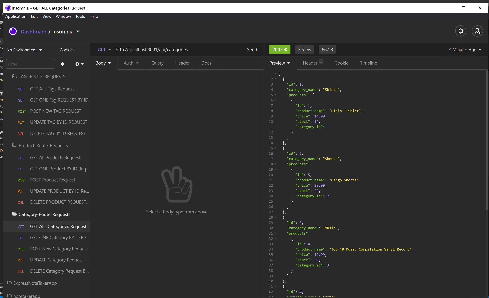
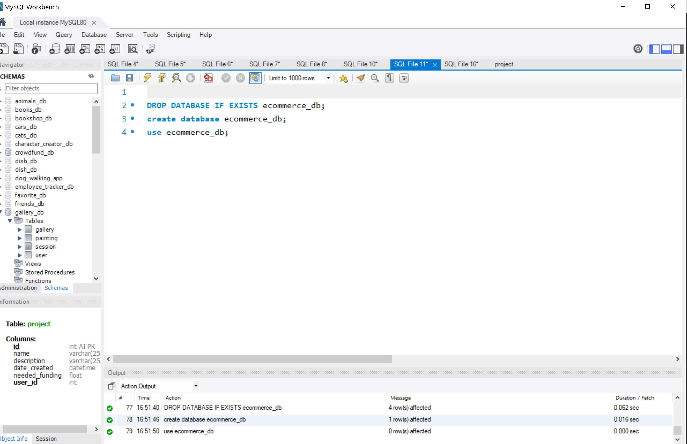
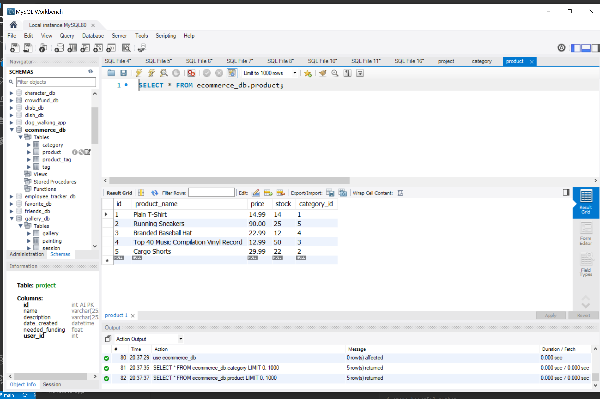

# E-Commerce Database

[](https://spdx.org/licenses/MIT.html)
 ## Table of Contents
1. [Description](#description)

2. [Installation](#installation)

3. [Usage](#usage)

4. [Contributions](#contributions)

5. [Questions](#questions)

-----

## Description
The E-Commerce Database application is an ORM or Object Relational Mapping application that is built for a mock E-Commere website. The application's platform is a configured Express.JS API that uses Sequelize to interact with our MySQL database. The process for development was to first analyze and map out our database, build Models for our SQL Data, build our associations or relationships that our Models have with one another, seed our database and finally construct our API requests. This application was lot of fun to build out. It builds upon previous projects that culminates just to the point of being a fullstack application. Further developments I would like to see for this app is to build out the front end using MVC to complete our backend to frontend relationship!

 -----

 ## Installation
 

   Getting Started:
   * check node is installed
   * npm installed
   * npm initialized
   * npm init
   * package.json and dependencies
  
    node -v
    npm install
    npm init --yes
    npm i express
    npm i mysql2
    npm i sequelize


  


 ## Usage

 ---

 Run MySQL Shell:
 
      cd db
      mysql -u root -p
      *enter password*
      quit
      cd ..

Seed the Database:
```
    npm run seed

```

   Start the Server:    
```
   node server.js
   OR
   nodemon server.js
```


   
Click To Watch Walkthrough video: 
--


[](https://drive.google.com/file/d/1JCOlDG3h0JEI6v0GaQSnD_xII086Ak8z/preview "Video title")


GIF of Requests in Insomnia:
--


Screenshot of Application in Insomnia:
--


Screenshot of Database in MYSQL Workbench:
--





Visit the Repo: 
[Github]**<https://github.com/bdurham227/E-Commerce>**

   


 ## License
 
[](https://spdx.org/licenses/MIT.html)

   https://opensource.org/licenses/MIT

    Licensed under the MIT License

    Copyright © [2021] [Benjamin Durham]
    

         Permission is hereby granted, free of charge, to any person obtaining a copy of this software and associated documentation files (the "Software"), to deal in the Software without restriction, including without limitation the rights to use, copy, modify, merge, publish, distribute, sublicense, and/or sell copies of the Software, and to permit persons to whom the Software is furnished to do so, subject to the following conditions:
        
        The above copyright notice and this permission notice shall be included in all copies or substantial portions of the Software.
        
        THE SOFTWARE IS PROVIDED "AS IS", WITHOUT WARRANTY OF ANY KIND, EXPRESS OR IMPLIED, INCLUDING BUT NOT LIMITED TO THE WARRANTIES OF MERCHANTABILITY, FITNESS FOR A PARTICULAR PURPOSE AND NONINFRINGEMENT. IN NO EVENT SHALL THE AUTHORS OR COPYRIGHT HOLDERS BE LIABLE FOR ANY CLAIM, DAMAGES OR OTHER LIABILITY, WHETHER IN AN ACTION OF CONTRACT, TORT OR OTHERWISE, ARISING FROM, OUT OF OR IN CONNECTION WITH THE SOFTWARE OR THE USE OR OTHER DEALINGS IN THE SOFTWARE

## Contribution
---

Jason Barbanel
<br>
https://github.com/Jbarbss
<br>
Takuya Matsomoto
<br>
https://github.com/TakuyaMats


 ## Questions
 ---
 For additional questions about usage, installation or application improvement contact me through

Github: https://github.com/bdurham227

Email: bdurham227@gmail.com:

